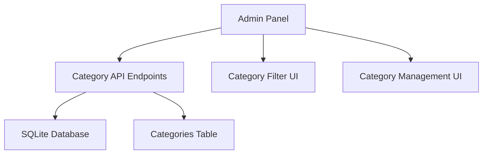

# Design Document: Admin Category Loading Fix

## Overview

This design addresses the admin panel category loading issue on the Render deployment by implementing a complete category management system. The solution includes backend API endpoints, database schema, frontend fixes, and automatic deployment.

## Architecture

The solution follows a three-tier architecture:

1. **Database Layer**: SQLite database with categories table
2. **API Layer**: Express.js REST endpoints for category operations
3. **Frontend Layer**: Admin panel with category management UI



## Components and Interfaces

### 1. Database Schema

**Categories Table:**
```sql
CREATE TABLE categories (
    id INTEGER PRIMARY KEY AUTOINCREMENT,
    name TEXT UNIQUE NOT NULL,
    description TEXT,
    created_at DATETIME DEFAULT CURRENT_TIMESTAMP
);
```

**Products Table Update:**
```sql
ALTER TABLE products ADD COLUMN category_id INTEGER REFERENCES categories(id);
```

### 2. API Endpoints

**GET /api/categories**
- Returns all categories
- Response: `{ categories: Category[] }`

**POST /api/admin/categories**
- Creates new category
- Body: `{ name: string, description?: string }`
- Response: `{ success: boolean, category: Category }`

**PUT /api/admin/categories/:id**
- Updates existing category
- Body: `{ name?: string, description?: string }`
- Response: `{ success: boolean, category: Category }`

**DELETE /api/admin/categories/:id**
- Deletes category
- Response: `{ success: boolean, message: string }`

### 3. Frontend Components

**Category Filter Component:**
- Displays category buttons
- Handles filter selection
- Shows loading and error states

**Category Management Component:**
- CRUD operations for categories
- Modal dialogs for create/edit
- Confirmation dialogs for delete

## Data Models

### Category Model
```typescript
interface Category {
    id: number;
    name: string;
    description?: string;
    created_at: string;
}
```

### API Response Models
```typescript
interface CategoriesResponse {
    categories: Category[];
}

interface CategoryResponse {
    success: boolean;
    category?: Category;
    error?: string;
}
```

## Correctness Properties

*A property is a characteristic or behavior that should hold true across all valid executions of a system-essentially, a formal statement about what the system should do. Properties serve as the bridge between human-readable specifications and machine-verifiable correctness guarantees.*

### Property 1: Category API Availability
*For any* request to `/api/categories`, the server should return a valid JSON response with categories array, even if empty
**Validates: Requirements 1.1, 1.2**

### Property 2: Database Table Creation
*For any* server startup, the categories table should exist in the database after initialization completes
**Validates: Requirements 2.1, 2.2**

### Property 3: Category CRUD Operations
*For any* valid category data, creating, reading, updating, and deleting operations should maintain data consistency
**Validates: Requirements 4.2, 4.3, 4.4**

### Property 4: Admin Panel Loading States
*For any* category loading operation, the admin panel should either display categories or show an appropriate error message, never infinite loading
**Validates: Requirements 3.1, 3.3**

### Property 5: Category Filter Functionality
*For any* category selection, the product list should display only products matching that category or all products for "All Products"
**Validates: Requirements 3.4, 3.5**

## Error Handling

### API Error Responses
- 400 Bad Request: Invalid category data
- 404 Not Found: Category not found
- 409 Conflict: Duplicate category name
- 500 Internal Server Error: Database errors

### Frontend Error Handling
- Network errors: Show retry button
- Loading timeouts: Display fallback message
- Empty categories: Show "No categories" message
- API errors: Display user-friendly error messages

### Database Error Handling
- Table creation failures: Log and retry
- Constraint violations: Return appropriate HTTP status
- Connection errors: Graceful degradation

## Testing Strategy

### Unit Tests
- Test category API endpoints with various inputs
- Test database operations (create, read, update, delete)
- Test frontend category filter logic
- Test error handling for edge cases

### Property-Based Tests
- **Property 1**: Category API response format validation
- **Property 2**: Database schema consistency checks
- **Property 3**: CRUD operation data integrity
- **Property 4**: UI loading state management
- **Property 5**: Filter functionality correctness

Each property test should run minimum 100 iterations and be tagged with:
**Feature: admin-category-loading-fix, Property {number}: {property_text}**

### Integration Tests
- Test complete category workflow from API to UI
- Test admin panel category management features
- Test category filtering with real product data
- Test deployment and database migration