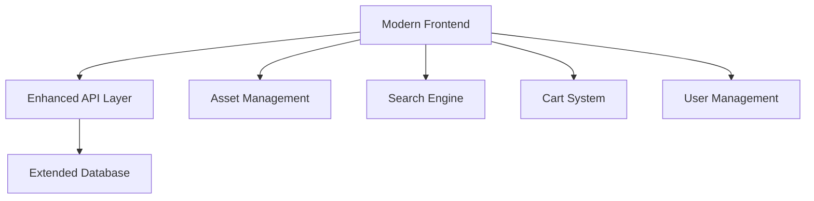

# Design Document: AliExpress-Style Website Redesign

## Overview

This design transforms the Ermi Mobile website into a modern AliExpress-style e-commerce platform with advanced features, responsive design, and professional appearance. The solution includes a complete UI/UX overhaul, enhanced functionality, and improved user experience.

## Architecture

The redesign follows a modern component-based architecture:

1. **Frontend Layer**: Modern HTML5, CSS3, and JavaScript with component architecture
2. **API Layer**: Enhanced REST API with search, filtering, and cart functionality
3. **Database Layer**: Extended schema for reviews, cart, and user preferences
4. **Asset Layer**: Optimized images, icons, and media management



## Components and Interfaces

### 1. Modern Header Component

**Features:**
- Prominent search bar with autocomplete
- Category navigation with dropdowns
- User account menu
- Shopping cart indicator
- Mobile hamburger menu

**HTML Structure:**
```html
<header class="modern-header">
    <div class="header-top">
        <div class="logo-section">
            
        </div>
        <div class="search-section">
            <input type="text" class="search-input" placeholder="Search products...">
            <button class="search-btn">🔍</button>
        </div>
        <div class="user-section">
            <div class="cart-icon">🛒 <span class="cart-count">0</span></div>
            <div class="user-menu">👤 Account</div>
        </div>
    </div>
    <nav class="category-nav">
        <div class="category-item">📱 Phones</div>
        <div class="category-item">🎧 Audio</div>
        <div class="category-item">⚡ Charging</div>
        <div class="category-item">🛡️ Protection</div>
    </nav>
</header>
```

### 2. Product Grid Component

**Features:**
- Responsive grid layout (1-4 columns)
- Product cards with hover effects
- Image lazy loading
- Quick view functionality
- Add to cart buttons

**CSS Grid System:**
```css
.product-grid {
    display: grid;
    grid-template-columns: repeat(auto-fill, minmax(280px, 1fr));
    gap: 20px;
    padding: 20px;
}

.product-card {
    background: white;
    border-radius: 12px;
    box-shadow: 0 2px 8px rgba(0,0,0,0.1);
    transition: transform 0.3s ease, box-shadow 0.3s ease;
}

.product-card:hover {
    transform: translateY(-5px);
    box-shadow: 0 8px 25px rgba(0,0,0,0.15);
}
```

### 3. Search and Filter System

**Search API Endpoint:**
```javascript
GET /api/search?q={query}&category={cat}&minPrice={min}&maxPrice={max}&sort={sort}
```

**Filter Component:**
- Category filters
- Price range slider
- Rating filters
- Brand filters
- Sort options

### 4. Shopping Cart System

**Cart Data Structure:**
```javascript
{
    id: "cart_123",
    userId: "user_456",
    items: [
        {
            productId: 1,
            name: "Wireless Earbuds",
            price: 2500,
            quantity: 2,
            image: "earbuds.jpg"
        }
    ],
    total: 5000,
    updatedAt: "2025-01-02T15:30:00Z"
}
```

## Data Models

### Extended Product Model
```typescript
interface Product {
    id: number;
    name: string;
    description: string;
    price: number;
    originalPrice?: number;
    discount?: number;
    images: string[];
    category: Category;
    rating: number;
    reviewCount: number;
    stock: number;
    features: string[];
    specifications: Record<string, string>;
    tags: string[];
    createdAt: string;
    updatedAt: string;
}
```

### User Cart Model
```typescript
interface Cart {
    id: string;
    userId: string;
    items: CartItem[];
    total: number;
    subtotal: number;
    tax: number;
    shipping: number;
    updatedAt: string;
}

interface CartItem {
    productId: number;
    quantity: number;
    selectedVariant?: string;
    addedAt: string;
}
```

### Review System Model
```typescript
interface Review {
    id: number;
    productId: number;
    userId: string;
    rating: number;
    title: string;
    content: string;
    images?: string[];
    helpful: number;
    verified: boolean;
    createdAt: string;
}
```

## User Interface Design

### Color Scheme (AliExpress-inspired)
```css
:root {
    --primary-color: #ff6b35;
    --secondary-color: #f7931e;
    --accent-color: #ff4757;
    --text-primary: #2c3e50;
    --text-secondary: #7f8c8d;
    --background: #f8f9fa;
    --white: #ffffff;
    --border: #e9ecef;
    --success: #27ae60;
    --warning: #f39c12;
    --danger: #e74c3c;
}
```

### Typography
```css
@import url('https://fonts.googleapis.com/css2?family=Inter:wght@300;400;500;600;700&display=swap');

body {
    font-family: 'Inter', -apple-system, BlinkMacSystemFont, sans-serif;
    font-size: 14px;
    line-height: 1.6;
    color: var(--text-primary);
}

.heading-1 { font-size: 2.5rem; font-weight: 700; }
.heading-2 { font-size: 2rem; font-weight: 600; }
.heading-3 { font-size: 1.5rem; font-weight: 600; }
.body-text { font-size: 1rem; font-weight: 400; }
.small-text { font-size: 0.875rem; font-weight: 400; }
```

### Responsive Breakpoints
```css
/* Mobile First Approach */
.container {
    max-width: 1200px;
    margin: 0 auto;
    padding: 0 16px;
}

@media (min-width: 768px) {
    .container { padding: 0 24px; }
    .product-grid { grid-template-columns: repeat(2, 1fr); }
}

@media (min-width: 1024px) {
    .container { padding: 0 32px; }
    .product-grid { grid-template-columns: repeat(3, 1fr); }
}

@media (min-width: 1200px) {
    .product-grid { grid-template-columns: repeat(4, 1fr); }
}
```

## Enhanced API Endpoints

### Search and Filter API
```javascript
// Search products with filters
GET /api/products/search
Query params: q, category, minPrice, maxPrice, rating, sort, page, limit

// Get product suggestions
GET /api/products/suggestions?q={query}

// Get trending products
GET /api/products/trending

// Get recommended products
GET /api/products/recommended?userId={id}
```

### Cart Management API
```javascript
// Get user cart
GET /api/cart

// Add item to cart
POST /api/cart/items
Body: { productId, quantity, variant }

// Update cart item
PUT /api/cart/items/{itemId}
Body: { quantity }

// Remove cart item
DELETE /api/cart/items/{itemId}

// Clear cart
DELETE /api/cart
```

### Review System API
```javascript
// Get product reviews
GET /api/products/{id}/reviews

// Add product review
POST /api/products/{id}/reviews
Body: { rating, title, content, images }

// Get review statistics
GET /api/products/{id}/reviews/stats
```

## Performance Optimizations

### Image Optimization
- WebP format with fallbacks
- Responsive images with srcset
- Lazy loading for below-fold images
- Image compression and CDN delivery

### Code Optimization
- CSS and JavaScript minification
- Critical CSS inlining
- Component-based architecture
- Progressive loading

### Caching Strategy
- Browser caching for static assets
- API response caching
- Service worker for offline support
- CDN for global content delivery

## Correctness Properties

*A property is a characteristic or behavior that should hold true across all valid executions of a system-essentially, a formal statement about what the system should do. Properties serve as the bridge between human-readable specifications and machine-verifiable correctness guarantees.*

### Property 1: Responsive Grid Layout
*For any* screen size, the product grid should display an appropriate number of columns and maintain proper spacing
**Validates: Requirements 2.4, 6.1**

### Property 2: Search Functionality
*For any* search query, the system should return relevant results and handle empty results gracefully
**Validates: Requirements 3.1, 3.5**

### Property 3: Cart State Management
*For any* cart operation (add, update, remove), the cart state should remain consistent and totals should be accurate
**Validates: Requirements 5.1, 5.3**

### Property 4: Mobile Responsiveness
*For any* mobile device, all interface elements should be accessible and properly sized for touch interaction
**Validates: Requirements 6.4, 1.4**

### Property 5: Performance Standards
*For any* page load, the initial content should be visible within 2 seconds and interactive within 3 seconds
**Validates: Requirements 6.2, 6.5**

## Error Handling

### Frontend Error Handling
- Network error recovery with retry mechanisms
- Graceful degradation for missing features
- User-friendly error messages
- Loading states and skeleton screens

### API Error Handling
- Proper HTTP status codes
- Detailed error messages
- Rate limiting protection
- Input validation and sanitization

## Testing Strategy

### Unit Tests
- Component functionality testing
- API endpoint testing
- Cart calculation testing
- Search algorithm testing

### Integration Tests
- End-to-end user workflows
- Cross-browser compatibility
- Mobile device testing
- Performance benchmarking

### Property-Based Tests
- **Property 1**: Grid layout responsiveness across screen sizes
- **Property 2**: Search result relevance and accuracy
- **Property 3**: Cart state consistency and calculations
- **Property 4**: Mobile touch interaction accessibility
- **Property 5**: Performance metrics and loading times

Each property test should run minimum 100 iterations and be tagged with:
**Feature: aliexpress-redesign, Property {number}: {property_text}**